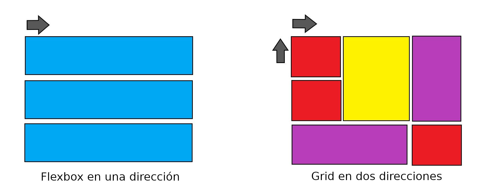

# Flexbox vs. Grid

Si estás en esta sección y aún no conoces **Flexbox** o **Grid**, te recomendamos antes de seguir,
que pases por nuestros artículos, donde vemos al detalle cada uno de ellos.

- [Flexbox](https://github.com/uqbar-project/css-05-display-flexbox)
- [Grid](https://github.com/uqbar-project/css-06-display-grid)

La idea central de este artículo no es responder ¿Cuál debemos usar?, o si **Flexbox** es mejor que **Grid** o todo lo contrario. Sino ver cualés son las diferencias o fines para los que fueron ideados.

La diferencia básica entre Flexbox y Grid es que el primero se creó para diseños de **una dimensión**, en **una fila o una columna**. En cambio Grid se pensó para el diseño **bidimensional**, en **varias filas y columnas** al mismo tiempo.

Sin embargo, con flexbox, haciendo uso de la propiedad **flex-wrap** podemos generar varias filas o columnas. Pero recordemos que trata, cada fila o columna, como una entidad independiente, en función de su contenido y del espacio disponible, haciendo que sea más complejo lograr tener el control.

Por otro lado, Grid, al permitirnos trabajar a lo largo de dos ejes: horizontal y verticalmente, es capaz de lograr diseños bidimensionales en los que podemos colocar elementos con precisión en celdas definidas por las filas y columnas.

Así como lo planteamos, parecería que es una debilidad que flexbox, tenga este enfoque pensado en el contenido y el espacio disponible, pero todo lo contrario. Si bien nos puede complicar para los diseños bidimensionales, se convierte en una gran fortaleza a la hora de brindarnos dinamísmo cuando necesitamos adaptarnos al contenido y poder distribuir los elementos en el espacio disponible. En este sentido, con flexbox, no es necesario indicarle a los elementos cómo queremos que se ubiquen, ya que ellos deciden cómo ir colocandose. Para obtener el mismo resultado con Grid, primero vamos a tener que centrarnos en definir las filas y columnas, es decir el diseño, primero, para luego decidir en qué celda colocar el contenido.

Con esto queremos decir que **Flexbox vs. Grid** no tiene por qué tener una respuesta tajante, sino que va a depender de distintos factores. Es probable que podamos llegar a resultados similares usando uno u otro, no obstante, siempre es bueno reflexionar cuál sirve mejor, para lograr el efecto deseado.
Lo que estamos seguros es que si combinamos **Flexbox** y **Grid**, siempre va a ser más fácil resolver diseños complejos, obteniendo los mejores resultados.

## El Debate en la comunidad CSS

Este no es un debate, propuesto por nosotros, sino que, desde la aparición de Grid, es un debate abierto en la comunidad del CSS.

A continuación les dejamos algunas experiencias y recomendaciones de distintos autores.

- En este [artículo](https://ishadeed.com/article/grid-layout-flexbox-components/) **Ahmad Shadeed**, argumenta que deberíamos _usar grid para el diseño y flexbox para los componentes_.

- La autora **Rachel Andrew**, en [esta publicación](https://www.smashingmagazine.com/2018/10/flexbox-use-cases/), nos deja su parecer, respecto a los casos de uso de Flexbox y sugerencias para decidir cuándo usar uno u otro medelo de layout.

- **Michelle Barker** respondió al [hilo viral](https://twitter.com/chriscoyier/status/1088827201468813312) de Twitter de **Chris Coyier** escribiendo un [artículo](https://css-irl.info/to-grid-or-to-flex/) sobre el tema Grid vs flexbox en su blog CSS {In real Life}.

- El mismo **Chris Coyier** a raíz del hilo viral mencionado, escribió este [artículo](https://css-tricks.com/quick-whats-the-difference-between-flexbox-and-grid/) en CSS-Tricks.

- La comunidad MDN tiene este [documento](https://developer.mozilla.org/es/docs/Web/CSS/CSS_Grid_Layout/Relacion_de_Grid_Layout), donde profundiza sobre las diferencias de Flexbox y Grid.

